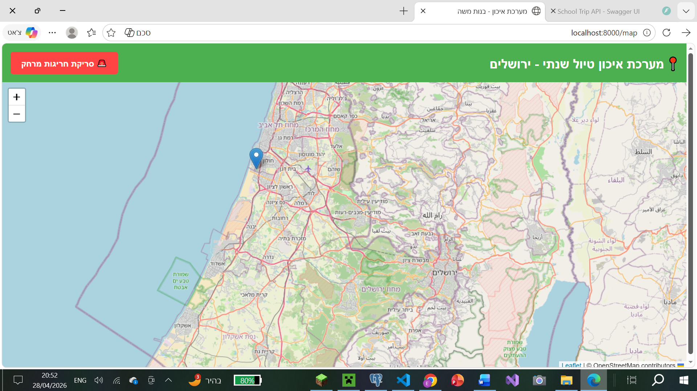
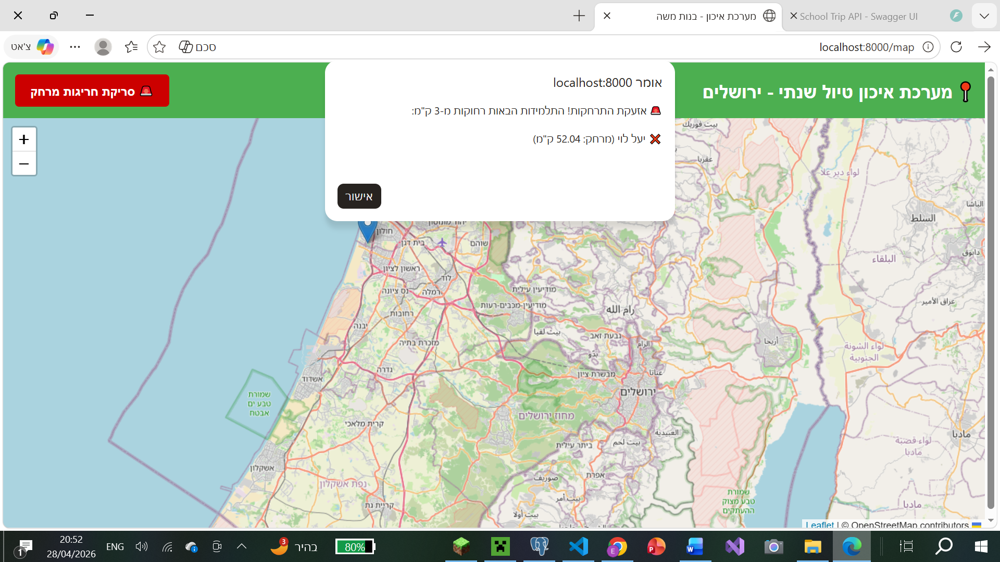
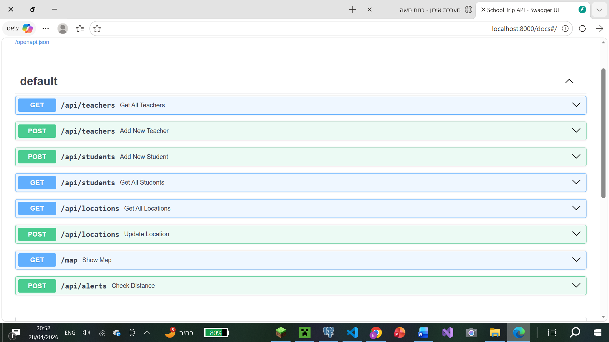
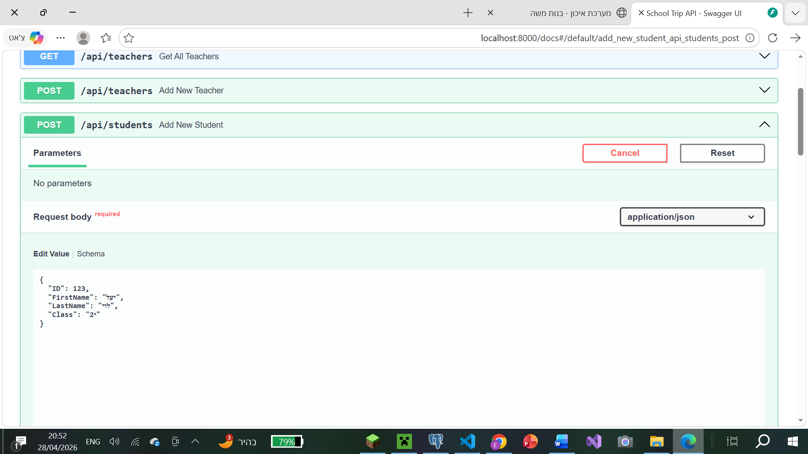

# 📍 School Trip Tracker - Real-Time Location API

A Full-Stack tracking system designed to monitor and manage student locations in real-time during school trips. The system allows teachers to view student positions on an interactive map and provides automated alerts for distance violations.

## 🛠 Tech Stack & Dependencies

The project is built using the following technologies:
* **Backend:** Python with **FastAPI**
* **Database:** **SQLite** (Built-in)
* **Frontend:** HTML/JS with **Leaflet.js** for interactive mapping
* **Server:** **Uvicorn** ASGI server

### Prerequisites
* Python 3.10 or higher.
* A modern web browser (Chrome, Edge, Firefox).

---

## 🚀 Installation & Setup

1. **Create and activate a virtual environment:**
    python -m venv venv
    venv\Scripts\activate

2. **Install required dependencies:**
    pip install fastapi uvicorn pydantic

3. **Run the Application:**
    Execute the following command in your terminal:
    uvicorn main:app --reload

    The server will start locally at: http://localhost:8000

---

## 💻 Usage Guide

The system features two main interfaces:

### 1. API Management Interface (Swagger UI)
Used for data entry: adding teachers, registering students, and simulating device location updates.
* **URL:** http://localhost:8000/docs
* Use the POST routes to populate the database and send coordinate updates.

### 2. Teacher's Map Dashboard
A live interactive map that automatically polls and updates student locations every 10 seconds.
* **URL:** http://localhost:8000/map
* **Distance Alert (Bonus Feature):** Clicking the "Distance Violation Scan" button calculates the Haversine distance between the teacher and all students. It instantly alerts the teacher if any student wanders beyond a 3 km radius.

---

## 📸 Screenshots

### Live Map View

### Distance Violation Alert

### Swagger UI / API Docs

---

## 📂 Project Structure
* main.py: Core backend application, database logic, and mathematical models.
* map.html: Frontend client and map rendering logic.
* school_trip.db: SQLite database file.
